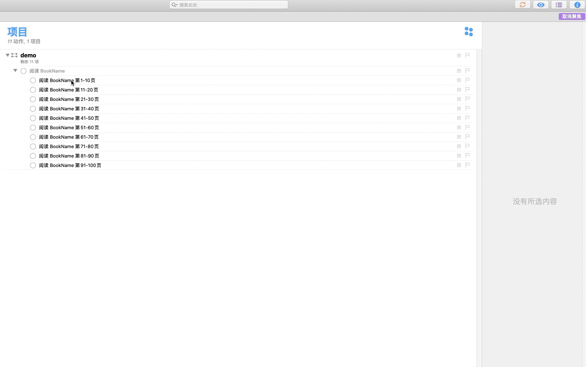

# Batch-Edit

根据选中的任务,批量修改指定的任务属性

运行此脚本会有两个弹窗:

第一个弹窗指需要修改的属性名字. 请自行查阅脚本编辑器自带的字典,并且查阅 Omnifocus 的 Task 类的属性文档 => [字典用法](https://developer.apple.com/library/archive/documentation/LanguagesUtilities/Conceptual/MacAutomationScriptingGuide/NavigateaScriptingDictionary.html#//apple_ref/doc/uid/TP40016239-CH77-SW1)

第二个弹窗是一个函数,脚本会按次序遍历每个任务,并且根据此函数的返回值对每个任务赋值.

此函数的函数签名

```javascript

/**
 * @params index 当前遍历的索引值(0 开始)
 * @params cur 当前被遍历的 task 对象
 * @params pre 上一个被遍历的 task 对象(遍历第一个时此值是空的)
 * @return 返回值,用来给当前 task 的具体属性赋值
 */
 (index:number,cur:Task,pre?:Task) => any
```


## 例子说明

批量修改选中的 task,使其开始时间 (deferData) 从 `2019-12-12 20:00` 开始依次增加一天

第一个弹窗输入: `deferData`

第二个弹窗输入函数:  `(index,cur,pre) => {return new Date(new Date('Thu Dec 12 2019 20:00:00 GMT+0800 (中国标准时间)').valueOf() + index * 24 * 60 * 60 * 1000) }`

> 代码中 `Thu Dec 12 2019 20:00:00 GMT+0800 (中国标准时间)` 的结果来自 chrome 的 console 输入`new Date()`本地化之后得到的结果. 具体用法请参考 [JS Date API](https://developer.mozilla.org/zh-CN/docs/Web/JavaScript/Reference/Global_Objects/Date)

